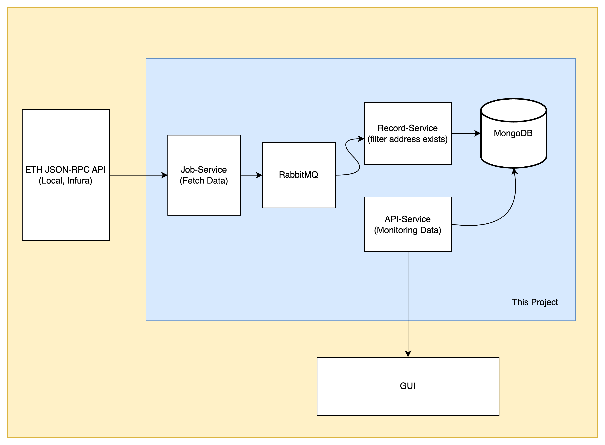

# Crypto Ethereum JSON-RPC Backend

## About

Features:
- Monitors incoming and outgoing transactions of specified Ethereum addresses and stamp to DB.
- Read latest transaction through restful API

How to use:
- Before running the project, add the addresses you want to monitor to the docker-compose.yml file at the ADDRESS_MONITOR environment variable. If there are multiple addresses, separate them with commas (,) without any whitespace.
- Add line credential for notification to the docker-compose.yml file at the LINE_NOTIFY_TOKEN.
- Running the project use the following commands and wait for the containers to be ready
- To show latest incoming and outgoing transactions using cURL below commands

Run Project:
```sh
cd crypto-satangpro
docker-compose up -d
```

curL:
```sh
curl --location 'localhost:8080/transaction/list' \
--header 'Content-Type: application/json' \
--data '{
    "address": "0x28c6c06298d514db089934071355e5743bf21d60",
    "page": 1,
    "perPage": 100
}'
```


## Project Architecture
